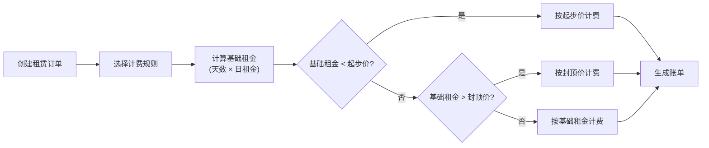
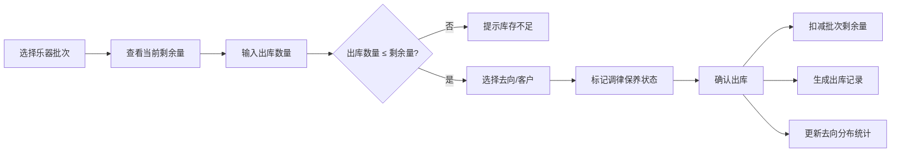

## 1. 产品概述

乐器租赁周转管理系统，面向乐器租赁企业，提供从乐器入库、批次管理、拆分出库到计费结算的全流程管理。核心解决短租起步价、长租封顶价的计费边界问题，以及批次拆分后的剩余量追踪和去向分布管理。

- **目标用户**：乐器租赁企业运营人员、仓库管理员、财务人员
- **核心价值**：精准计费、批次追溯、库存透明、保养有序

## 2. 核心功能

### 2.1 用户角色

| 角色 | 登录方式 | 核心权限 |
|------|----------|----------|
| 运营管理员 | 账号密码 | 全部功能，计费规则配置，数据统计 |
| 仓库管理员 | 账号密码 | 批次管理，拆分出库，调律保养 |
| 财务人员 | 账号密码 | 账单生成，费用核算，对账 |

### 2.2 功能模块

1. **计费规则模块**：计费规则配置、起步价计算、封顶价拦截、价格试算
2. **账单生成模块**：租赁订单管理、账单自动生成、费用明细、账单查询
3. **乐器批次模块**：批次登记、批号效期管理、剩余量追踪、库存总览
4. **拆分出库模块**：批次拆分出库、去向分布记录、调律保养排期、出库历史

### 2.3 页面详情

| 页面名称 | 模块名称 | 功能描述 |
|-----------|-------------|---------------------|
| 首页总览 | 数据仪表盘 | 核心指标卡片、库存趋势、账单统计、待办事项 |
| 计费规则 | 规则列表 | 规则增删改查、按乐器类型分类、启用/禁用 |
| 计费规则 | 规则配置 | 起步价设置、日租金设置、封顶价设置、计算逻辑预览 |
| 账单管理 | 账单列表 | 账单查询筛选、状态标签、导出功能 |
| 账单管理 | 账单详情 | 费用明细、计费周期、起步/封顶说明、收款记录 |
| 乐器批次 | 批次列表 | 批次查询、效期预警、剩余量显示、状态标签 |
| 乐器批次 | 批次详情 | 基本信息、出入库历史、剩余量追踪、去向分布 |
| 拆分出库 | 出库列表 | 出库记录、去向分布统计、操作人信息 |
| 拆分出库 | 新建出库 | 选择批次、输入数量、选择去向、调律保养标记 |
| 保养排期 | 保养日历 | 调律保养排期、待保养提醒、保养记录 |

## 3. 核心流程

### 3.1 租赁计费流程

### 3.2 批次拆分出库流程

## 4. 用户界面设计

### 4.1 设计风格

- **主色调**：深檀木色 (#3E2723) - 体现乐器的木质质感和专业感
- **辅助色**：金色 (#D4AF37) - 象征乐器的精致与价值
- **强调色**：青绿色 (#009688) - 用于状态提示和操作按钮
- **中性色**：暖灰色系 - 营造温暖专业的氛围

- **按钮风格**：圆角设计，微阴影，hover时有轻微上浮效果
- **字体**：标题用思源宋体（典雅），正文用思源黑体（清晰易读）
- **布局风格**：卡片式布局，左侧导航 + 右侧内容区
- **图标风格**：线性图标，与主题色保持一致

### 4.2 页面设计概览

| 页面名称 | 模块名称 | UI元素 |
|-----------|-------------|-------------|
| 首页总览 | 仪表盘 | 数据卡片网格、趋势图表、待办列表、暖色调背景 |
| 计费规则 | 规则列表 | 表格布局、状态标签、操作按钮组、筛选栏 |
| 账单管理 | 账单列表 | 卡片式列表、金额突出显示、状态色标、分页 |
| 乐器批次 | 批次列表 | 卡片网格、效期进度条、剩余量环形图、预警色标 |
| 拆分出库 | 出库表单 | 分步表单、数量滑块、去向选择器、确认弹窗 |
| 保养排期 | 日历视图 | 月历视图、日期标记、详情侧边栏、提醒红点 |

### 4.3 响应式设计

- **设计策略**：桌面端优先，移动端自适应
- **断点设置**：lg(1024px) 桌面端、md(768px) 平板端、sm(640px) 手机端
- **移动端适配**：左侧导航变为底部Tab栏，表格变为卡片列表，表单单列布局
- **触控优化**：按钮最小高度44px，手势滑动支持日历切换

### 4.4 动效设计

- **页面切换**：淡入淡出 + 轻微位移动画
- **卡片悬停**：轻微上浮 + 阴影加深
- **数据变化**：数字滚动动画
- **状态提醒**：脉冲动画吸引注意力
- **加载状态**：骨架屏 + 渐变扫光效果
