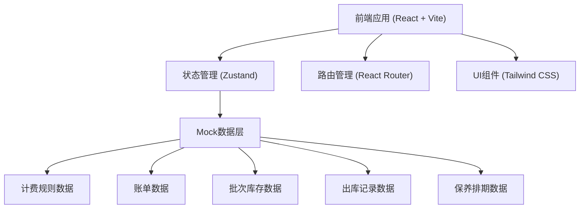
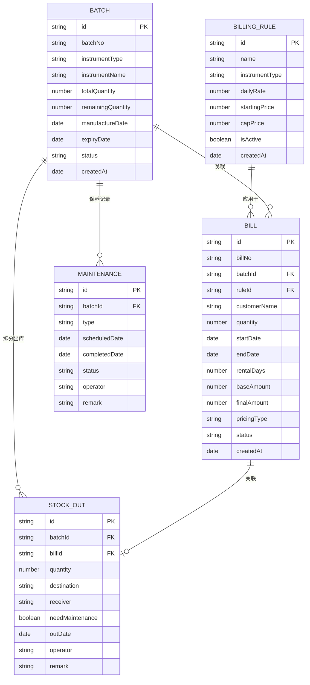

## 1. 架构设计



## 2. 技术描述

- **前端框架**：React@18 + TypeScript + Vite
- **状态管理**：Zustand
- **路由管理**：react-router-dom@6
- **样式方案**：Tailwind CSS@3
- **图标库**：lucide-react
- **数据方案**：前端Mock数据 + localStorage持久化
- **构建工具**：Vite@5
- **包管理器**：npm

## 3. 路由定义

| 路由路径 | 页面名称 | 说明 |
|----------|----------|------|
| / | 首页总览 | 数据仪表盘，核心指标概览 |
| /billing-rules | 计费规则 | 计费规则列表与配置 |
| /bills | 账单管理 | 账单列表与详情 |
| /batches | 乐器批次 | 批次列表与详情 |
| /stock-out | 拆分出库 | 出库记录与新建出库 |
| /maintenance | 保养排期 | 调律保养日历与记录 |

## 4. 数据模型

### 4.1 数据关系图



### 4.2 数据实体定义

#### 计费规则 (BillingRule)
```typescript
interface BillingRule {
  id: string;
  name: string;
  instrumentType: string;
  dailyRate: number;
  startingPrice: number;
  capPrice: number;
  isActive: boolean;
  createdAt: string;
}
```

#### 乐器批次 (Batch)
```typescript
interface Batch {
  id: string;
  batchNo: string;
  instrumentType: string;
  instrumentName: string;
  totalQuantity: number;
  remainingQuantity: number;
  manufactureDate: string;
  expiryDate: string;
  status: 'normal' | 'warning' | 'expired';
  createdAt: string;
}
```

#### 账单 (Bill)
```typescript
interface Bill {
  id: string;
  billNo: string;
  batchId: string;
  ruleId: string;
  customerName: string;
  quantity: number;
  startDate: string;
  endDate: string;
  rentalDays: number;
  baseAmount: number;
  finalAmount: number;
  pricingType: 'normal' | 'starting' | 'cap';
  status: 'unpaid' | 'paid' | 'cancelled';
  createdAt: string;
}
```

#### 出库记录 (StockOut)
```typescript
interface StockOut {
  id: string;
  batchId: string;
  billId: string | null;
  quantity: number;
  destination: string;
  receiver: string;
  needMaintenance: boolean;
  outDate: string;
  operator: string;
  remark: string;
}
```

#### 保养记录 (Maintenance)
```typescript
interface Maintenance {
  id: string;
  batchId: string;
  type: 'tuning' | 'repair' | 'cleaning';
  scheduledDate: string;
  completedDate: string | null;
  status: 'pending' | 'completed' | 'cancelled';
  operator: string;
  remark: string;
}
```

## 5. 目录结构

```
src/
├── components/          # 公共组件
│   ├── Layout/         # 布局组件
│   ├── Card/          # 卡片组件
│   ├── Table/          # 表格组件
│   ├── Modal/           # 弹窗组件
│   └── Chart/           # 图表组件
├── pages/              # 页面组件
│   ├── Dashboard/      # 首页总览
│   ├── BillingRules/   # 计费规则
│   ├── Bills/         # 账单管理
│   ├── Batches/        # 乐器批次
│   ├── StockOut/       # 拆分出库
│   └── Maintenance/   # 保养排期
├── store/              # 状态管理
│   ├── useBillingRuleStore.ts
│   ├── useBillStore.ts
│   ├── useBatchStore.ts
│   ├── useStockOutStore.ts
│   └── useMaintenanceStore.ts
├── types/              # TypeScript 类型定义
│   └── index.ts
├── utils/              # 工具函数
│   ├── pricing.ts      # 计费计算
│   ├── date.ts         # 日期处理
│   └── mock.ts         # Mock数据
├── App.tsx
├── main.tsx
└── index.css
```

## 6. 核心计算逻辑

### 6.1 租金计算逻辑

```typescript
function calculateRentalPrice(
  dailyRate: number,
  days: number,
  startingPrice: number,
  capPrice: number
): {
  baseAmount: number;
  finalAmount: number;
  pricingType: 'normal' | 'starting' | 'cap';
} {
  const baseAmount = dailyRate * days;
  
  if (baseAmount < startingPrice) {
    return {
      baseAmount,
      finalAmount: startingPrice,
      pricingType: 'starting'
    };
  }
  
  if (baseAmount > capPrice) {
    return {
      baseAmount,
      finalAmount: capPrice,
      pricingType: 'cap'
    };
  }
  
  return {
    baseAmount,
    finalAmount: baseAmount,
    pricingType: 'normal'
  };
}
```

### 6.2 批次剩余量计算

```typescript
function calculateRemainingQuantity(
  batch: Batch,
  stockOuts: StockOut[]
): number {
  const outQuantity = stockOuts
    .filter(so => so.batchId === batch.id)
    .reduce((sum, so) => sum + so.quantity, 0);
  return batch.totalQuantity - outQuantity;
}
```
